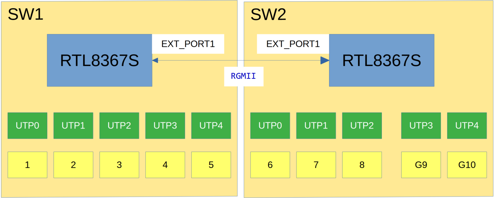
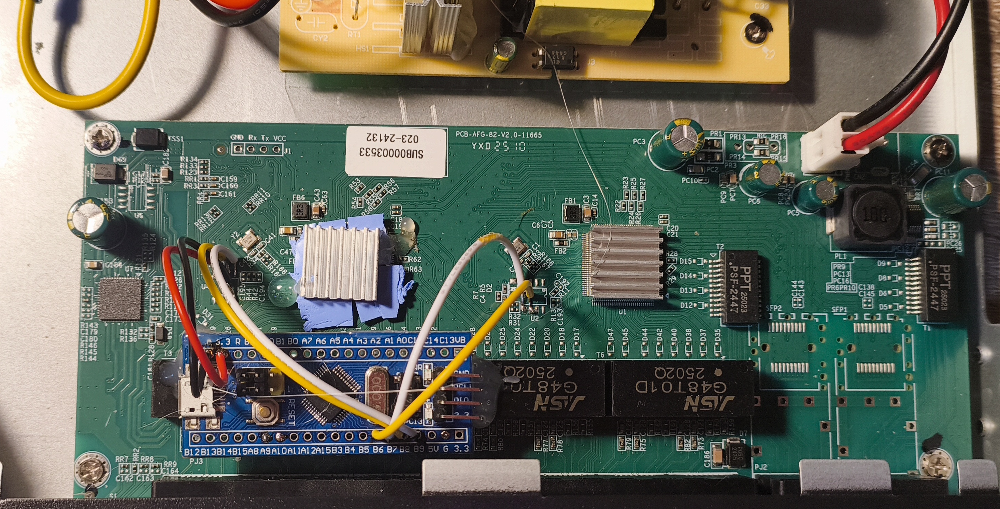

# Converting an RTL8367S-Based Switch from Unmanaged to Managed

## Switch description

### [Switch model: ZX900-AFG-82N](https://www.aliexpress.com/item/1005009455803023.html)

This switch contains two RTL8367S chips connected via the RGMII interface.

## Implementation Details

The switch uses an unknown microcontroller. I couldn't find a pin-to-pin compatible replacement 
that would allow flashing custom firmware. As a result, I added an external controller.
 The RTL8367S chips are configured to remain idle and wait for configuration via the SMI bus. 
 To avoid conflicts, the original controller must be unsoldered.

Tested on [Blue Pill](https://stm32-base.org/boards/STM32F103C8T6-Blue-Pill) board
I have a strange Chinese clone without CAN support and with 128KB of RAM. The debug build doesn't fit into 64KB of flash,
but the release build should fit on the original Blue Pill with 64KB of flash.

### Pins config
PB8 -> SCL (RTL8367S near port 1-5) 
PB9 -> SDA (RTL8367S near port 1-5)
PB6 -> SCL (RTL8367S near port 5-10) 
PB7 -> SDA (RTL8367S near port 5-10)
 

## Works

L2 vlans works. Config hardcoded as json.
### Hardcoded config details

port 1 - port for IP phone (VLAN240 for ip phone, VLAN 11 for PC connected to IP phone)
port 9 and 10 uplink ports
ports 2-8 - ports with some vlan 

Switch with custom controller

## Todo

Add upload json config via serial. 

## Comments

### PoE
The TMI7608S PoE chip supports control via I²C, but by default it starts in Auto mode and supplies power to 
connected powered devices (PDs) automatically.

### Network Management
The switch can theoretically be converted to a network-managed device via Wi-Fi using an ESP32, or via Ethernet 
using an ESP32 or STM32F107 by repurposing one of the existing Ethernet ports.  

## Links

API source [Realtek-Unmanaged-Switch-Arduino-Library](https://github.com/shiroichiheisen/Realtek-Unmanaged-Switch-Arduino-Library)
